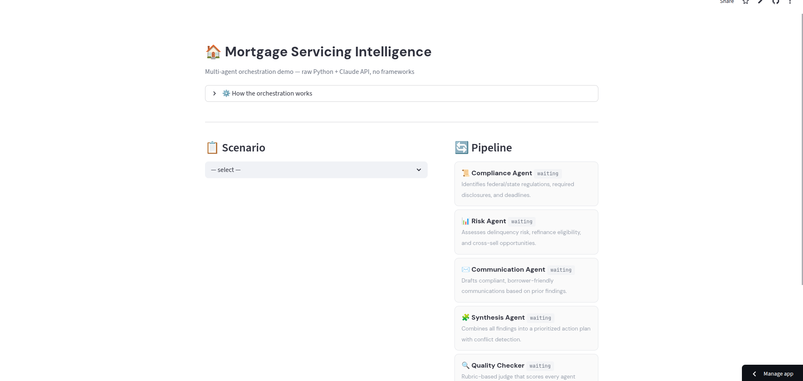

# Mortgage Servicing Intelligence

**Multi-agent LLM orchestration for mortgage servicing analysis — built with raw Python + Claude API, no frameworks.**

Input a mortgage scenario — forbearance, collections, loan modification — and 5 specialized AI agents produce a unified action plan with compliance analysis, risk assessment, borrower communication, and quality evaluation. No LangChain, no LangGraph, no CrewAI — just Python orchestration from scratch.


<!-- Replace with actual screenshot -->

**[Try the Live Demo →](your-streamlit-url)**

---

## Architecture

Compliance and Risk agents run independently, then feed into Communication, Synthesis, and a final LLM-as-Judge quality check.

```
Input Scenario
     │
     ├───────────────────┐
     ▼                   ▼
┌───────────┐     ┌───────────┐
│ Compliance│     │   Risk    │    ← Step 1: Independent
│   Agent   │     │   Agent   │
└─────┬─────┘     └─────┬─────┘
      └────────┬────────┘
               ▼
      ┌──────────────┐
      │Communication │             ← Step 2: Depends on Step 1
      │    Agent     │
      └──────┬───────┘
             ▼
      ┌──────────────┐
      │  Synthesis   │             ← Step 3: Depends on all
      │    Agent     │
      └──────┬───────┘
             ▼
      ┌──────────────┐
      │   Quality    │             ← Step 4: LLM-as-Judge
      │   Checker    │               (rubric-based evaluation)
      └──────────────┘
```

**Stack:** Python · Claude Sonnet (Anthropic) · Streamlit

## Why No Framework?

Building the orchestrator from scratch demonstrates understanding of what tools like LangGraph abstract away: dependency resolution, state management, structured output parsing, retry logic, and error isolation. The entire pipeline engine is ~200 lines in `orchestrator.py`.

## Orchestration Patterns

- **Agent Registry** — each agent is a dataclass with system prompt, output schema, and metadata
- **DAG Execution** — dependency graph drives execution order automatically
- **Shared State** — `PipelineState` dataclass accumulates outputs across agents
- **Structured Output** — every agent returns validated JSON matching its schema, with retry logic (2 retries on parse failure)
- **LLM-as-Judge** — Quality Checker scores all outputs on a 5-dimension rubric (accuracy, completeness, consistency, communication quality, actionability)
- **Error Isolation** — one agent's failure doesn't crash the pipeline
- **Status Callbacks** — real-time UI updates as nodes execute

## Agents

1. **Compliance** — federal/state regulations, disclosures, deadlines
2. **Risk** — delinquency risk, refinance eligibility, cross-sell opportunities
3. **Communication** — drafts compliant borrower letters (depends on 1 & 2)
4. **Synthesis** — unified action plan with conflict detection (depends on 1–3)
5. **Quality Checker** — rubric-based evaluation across all outputs (depends on 1–4)

## Scenarios

12 built-in scenarios across 4 segments:

- **Servicer** — forbearance, refinance, escrow shortage, early payoff
- **Collections** — pre-foreclosure, debt validation, deficiency judgment, third-party handoff
- **Originator** — servicing transfer, VA loan assumption
- **Investor/GSE** — loan modification, FHA partial claim

## Project Structure

```
├── agents.py          # Agent definitions (system prompts + schemas)
├── orchestrator.py    # Pipeline engine (DAG execution, state, retries)
├── scenarios.py       # Synthetic mortgage scenarios
├── app.py             # Streamlit UI
└── requirements.txt
```

## Quickstart

```bash
git clone https://github.com/your-repo/mortgage-servicing-intelligence.git
cd mortgage-servicing-intelligence
pip install -r requirements.txt
export ANTHROPIC_API_KEY="sk-ant-..."
streamlit run app.py
```

## Built By

**[Karan Rajpal](https://www.linkedin.com/in/karan-rajpal/)** — UC Berkeley Haas MBA '25 · LLM Validation @ Handshake AI (OpenAI/Perplexity) · Former 5th hire at Borderless Capital
